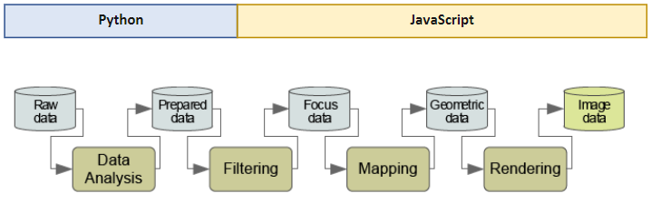

# Video Game Dataset Visualization Website

This project was developed in the context of the visualisation lecture in the summer semester 2020 of the Human Centered Computing course at Reutlingen University.
The final product is hosted on Github under [ge2thez.github.io/vis2020/](https://ge2thez.github.io/vis2020/).


# Data

For the vizualizations shown on this website, the [Video Game Sales with Ratings](https://www.kaggle.com/rush4ratio/video-game-sales-with-ratings) dataset was enriched with the [Video Game Sales](https://www.kaggle.com/ashaheedq/video-games-sales-2019) dataset.
The dataset Video Game Sales with Ratings was selected for the analysis. While analyzing the CSV file, it was noticed that the dataset in the Publisher and Year columns are incomplete. Therefore, the Video Game Sales dataset was used. By merging the two datasets, the incompleteness was reduced.

## Data Collection
The Datasets were acquired from Kaggle. The data itself was collected through a script from the GameDB database of vgchartz.com. They were collected in the period from 1980 to 2020 and contain ~60000 entries.

## Data processing and transformations
The main preprocessing of the data set is done with Python and the Pandas library, which allows the efficient and fast import of a CSV file and the further processing of the imported data. In this way, it can be ensured that the visualizations and interactions take place in "real time".

After the implementation of the data processing functions, the interactive generation of the carousel view was tested. The only delay that was noticed was when selecting a genre and calculating all publishers in the second depth view. This delay is still less than 1-2 seconds and occurs only when rendering the new website, so it looks like a load time. Should performance problems be encountered in the future (which should not happen), the implemented data processing functions can still be optimized.

## Data Visualization and Tools
The main languages used to implement this site and the visualisations are Pyhton and Typescript(JavaScript). Python was used for the pre processing of our dataset. Since the site is build with Angular, we used TypeScript for the creation of the website. The visualisations are created with the frameworks d3.js and chart.js. 



# Target Group
Our target group includes market researchers, companies and players who can view and compare the development of a genre or publisherover a period of time. Furthermore, the visualization can be used for marketing purposes and players can inform themselves about popular games or the best rated games.

# Building Blocks
In this chapter we summarize the main building blocks of the application from data preparation to visualization.

## Folder structure and purpose
Here is a very rough description of where which files are located and what the project structure looks like. This should help you to get a quick start in the project.
```$xslt
 - data               | Contains Python Programm for the preprocessing of the datasets, the original datasets and the preprocessed datasets
 - src                | Contains the source files of the angular application
 -- models            | Contains the internal data representations of the dataset and the visualizations
 --- app
 ---- services        | Contains Services used to globally transfer states or data across the application
 ----- DataService.ts | This is the main service where data is processed for the stacked area and stream graph
 ---- shared          | Contains components which can be reused. E.g. graphs like the bar chart and the radar chart
```

## Frameworks/Languages used and its purpose
* **Angular** | to build the application
* **Bootstrap** | CSS Framework for the Website Style
  * **Lumen Bootstrap Theme** | Freely available custom Bootstrap Theme
* **D3.js** | Visualization of stacked area and stream graph
* **chart.js** | Visualization of other graphs
* **Python** | Used for the preprocessing of the datasets
  * Pandas | Processing of imported data


# How to run
## Prerequisites
* NodeJs
* Python (to run the pre processing if needed. Current project already has preprocessed data)

## How to run
1. Clone the project
2. Run npm install in the root project folder to install the dependencies
3. npm start to run the project in the development server. Navigate to `http://localhost:4200/`.
